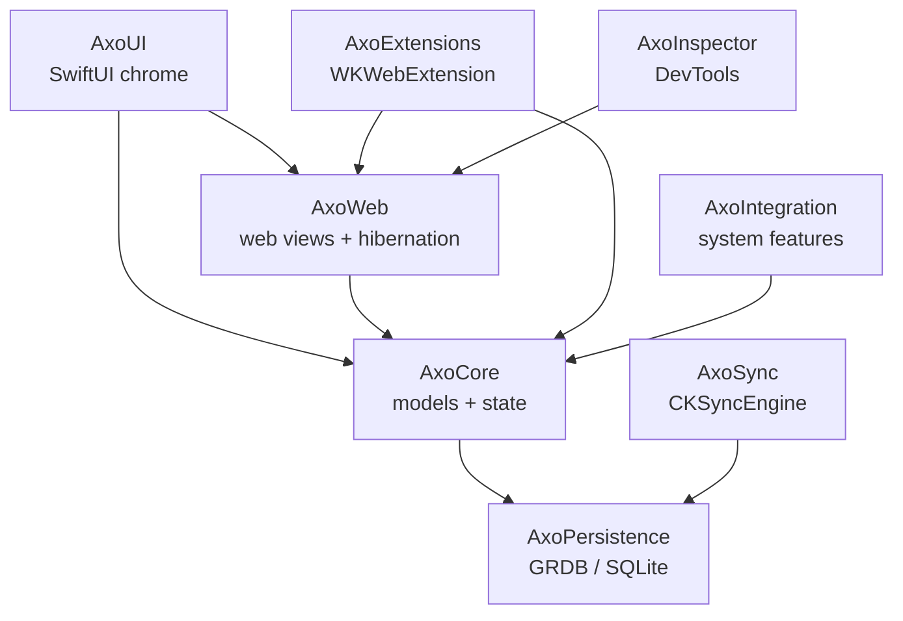

# Axo: Project Plan

## Vision

Axo is a native, lean, open source browser for the Apple ecosystem, inspired by Arc's sidebar and Spaces model. It runs on WebKit and SwiftUI, starts on macOS, and promises long-term maintenance, with the full codebase open sourced by the end of 2028.

Three pillars guide every decision:

- **Native and fully integrated** with Apple platforms
- **Performant, lean, and easy to use**
- **Still maintained**, backed by the 2028 open source commitment

The mascot is an axolotl, known for regenerating, which doubles as the story behind the maintenance promise. A personal goal shapes priorities too: Axo should demonstrate WebKit and Apple platform expertise at a level Apple's WebKit and Safari teams notice.

Funding starts free, with sponsorships added later.

## Brand

Full guidelines live in `docs/brand/axo-brand-sheet.html` (open it in a browser).

| Element | Decision |
| --- | --- |
| Symbol | Solid, front-facing axolotl head with the face and gill roots carved out. It is the brand logo, the app icon, and the favicon. File: `docs/brand/axo-logo.svg` |
| App icon | The symbol centered on a Raspberry rounded tile, with the face showing the tile behind it. File: `docs/brand/axo-app-icon.svg` |
| Single color | The same symbol in one ink (`currentColor`) for the menu bar, favicon, and README. File: `docs/brand/axo-logo-mono.svg` |
| Color | Raspberry `#9B2A5C`, Blush `#FFEEF3`, Axolotl Pink `#FF9EC2`, Ink `#1C1B1F`, Stone `#9A9A9E`, Paper `#F4EEF1` |
| Type | Nunito (ExtraBold and Black) for display and the wordmark; SF Pro for interface and body text |
| Character | Happy by default, Sleepy for hibernated tabs, Surprised for failed loads and crash recovery |
| Voice | Warm, not cutesy. Native and lean. Still maintained. |

Pink stays an accent inside the browser UI so it never competes with the pages people read. Axo the character appears in empty and status states, never in settings or permission prompts.

## Technical foundations

Axo targets macOS 27 and later. `WKWebExtension` has been public since macOS 15.4, but targeting the latest release keeps the code simple, with no availability checks, and gives access to the newest APIs.

| Area | Choice |
| --- | --- |
| Language | Swift 6 with strict concurrency |
| UI | SwiftUI for browser chrome, AppKit `WKWebView` for web content |
| Engine | WebKit (`WKWebView`, `WKWebExtensionController`) |
| Storage | SQLite through GRDB, one database for everything |
| Sync | CloudKit via `CKSyncEngine` |
| Distribution | Notarized DMG outside the Mac App Store, Sparkle for updates |
| License | TBD (MPL-2.0 is the likely fit); dependencies must stay compatible with it for the 2028 release |

## Architecture

Axo is split into Swift packages with clear boundaries, so each can be tested alone and several can be open sourced early.



Arrows point from a package to what it depends on; AxoCore sits at the center.

| Package | Responsibility |
| --- | --- |
| AxoUI | Windows, sidebar, command bar, settings, mascot. Never creates or destroys web views. |
| AxoCore | Profiles, spaces, folders, tabs, windows, and the TabStore. Tabs reference a web view but don't require one. |
| AxoWeb | Web view pool, `NSViewRepresentable` host, navigation and UI delegates, downloads, permissions, hibernation. One `WKWebsiteDataStore(forIdentifier:)` per profile. |
| AxoExtensions | One `WKWebExtensionController` per profile, CRX install (verify, strip CRX3 header, unzip, load), `WKWebExtensionTab` and `WKWebExtensionWindow` adapters, `unsupportedAPIs` surfaced in the extension manager. |
| AxoInspector | All private WebKit API behind runtime checks: the inspector (`developerExtrasEnabled`, `_WKInspector`, with public `isInspectable` as the fallback) and picture in picture (`_allowsPictureInPictureMediaPlayback`). |
| AxoPersistence | The single GRDB database: sidebar model, history, bookmarks, and an FTS5 index for the command bar. `DatabasePool` for concurrent reads, `DatabaseMigrator` for schema changes, `ValueObservation` plus GRDBQuery for reactive SwiftUI. |
| AxoSync | Maps spaces, folders, and pinned tabs to CloudKit records with `CKSyncEngine`. No servers to run. |
| AxoImport | Reads Arc's sidebar file and Chrome's bookmarks, plus Chromium history from both, and imports them through AxoCore. |
| AxoIntegration | Default browser, location services, App Intents, Focus filters, Handoff, Spotlight, passkeys, Screen Time, Translation. |

One database keeps storage simple to test, migrate, and sync. SwiftData and Core Data were ruled out because they lack full-text search, add overhead on write-heavy history, fit awkwardly with Swift 6 concurrency, and their built-in CloudKit sync gives no control over ordering or conflicts.

## Data model

Models are plain Swift structs conforming to GRDB records, and they never hold live runtime state.

```swift
struct Tab: Codable, FetchableRecord, PersistableRecord, Identifiable {
    var id: UUID
    var spaceID: UUID
    var folderID: UUID?
    var url: URL
    var title: String
    var sortKey: String      // fractional index
    var isPinned: Bool
    var archivedAt: Date?
}
```

- **Fractional sort keys:** each item's `sortKey` sorts between its neighbors, so a move updates one row and concurrent reorders on two devices rarely collide during sync. `SortKey` in AxoCore uses keys with an integer part plus a base-62 fraction, so appending or prepending only grows keys logarithmically. When two rows share a key after a merge, order them by ID.
- **Schema as built:** the first migration (`v1-profiles-spaces-tabs`) creates `profile`, `space`, and `tab`. UUIDs are stored as 16-byte blobs, and deleting a profile or Space cascades to its children. `folderID` arrives with folders in Milestone 2 as a new migration.
- **Runtime separation:** the web view pool in AxoWeb maps tab IDs to live `WKWebView`s. Persisted tabs store only URL, title, order, and archive state, which keeps hibernation and extension adapters clean.
- **Hibernation:** an idle tab keeps its URL, title, favicon, snapshot, and `interactionState`, so it restores instantly with history.

## Platform strategy

The long-term goal is a WebKit browser on every platform, starting with the Mac. Each platform has a very different starting point:

| Platform | WebKit state | Extension support |
| --- | --- | --- |
| macOS, iOS, iPadOS | `WKWebView`, maintained by Apple | Public `WKWebExtension` APIs since macOS 15.4 and iOS 18.4 |
| Linux | WebKitGTK and WPE, with a public C API (`webkit2/webkit2.h`) | No public extension layer; Axo would implement the WebExtensions runtime itself |
| Windows | WebKit's Windows port exists (Playwright uses it) but is not production grade | Same as Linux, on a weaker engine |

So the Mac, then iPhone and iPad, get a strong story; Linux is possible but expensive; Windows is weak. If full cross-platform Chrome extension support ever becomes a hard requirement, the alternative is Chromium (CEF or a fork), which trades WebKit's efficiency and native feel for extensions that just work. Axo stays on WebKit and validates the product on the Mac before committing to the hard platforms.

Competitive context: The Browser Company stopped active Arc development in 2025 to focus on Dia, leaving Arc users looking for a maintained alternative. Native open source Arc alternatives already exist (Ora, Aura), so Axo differentiates on real Chrome extension support, built-in DevTools, and deep Apple ecosystem integration.

## Web content and tabs

SwiftUI draws the browser chrome; web content is an AppKit `WKWebView` hosted through `NSViewRepresentable`. Axo does not use SwiftUI's newer `WebView` and `WebPage`, because it needs the real `WKWebView` for `WKWebExtensionTab` conformance, the private inspector, fine-grained navigation delegates, and web views that survive SwiftUI view updates.

- **Ownership:** web views are long-lived objects owned by the web view pool, not by SwiftUI. SwiftUI only decides which one is mounted, so view tree changes never reload pages or lose state.
- **Hibernation:** each live `WKWebView` costs a web content process, so idle tabs are discarded after a configurable time. The tab keeps its URL, title, favicon, and a snapshot image, and `interactionState` restores its back and forward history when it wakes.
- **Profiles:** each profile gets an isolated `WKWebsiteDataStore(forIdentifier:)` (public since macOS 14) with its own cookies, storage, and cache. Spaces point at a profile.

## Chrome extensions

A Chrome extension can't load native code or talk to WebKit directly; it runs sandboxed JavaScript. WebKit's own WebExtensions runtime solves this on Apple platforms.

**Two Apple technologies with similar names.** Safari Web Extensions are packaged inside an app as an `.appex`, ship through the App Store, and run only in Safari. `WKWebExtension` is the newer WebKit API for third-party browsers: it loads a plain extension folder (`manifest.json`, scripts, icons) into Axo's own web views, managed by Axo's own controller. Safari never needs to be installed, running, or involved.

**Verified facts** (Apple developer documentation): `WKWebExtension`, `WKWebExtensionContext`, and `WKWebExtensionController` are public from macOS 15.4, iOS 18.4, iPadOS 18.4, and visionOS 2.4. They load unpacked folders through `init(resourceBaseURL:)`, support Manifest V2 and V3, and expose `unsupportedAPIs` on each context.

```swift
let controller = WKWebExtensionController()
let config = WKWebViewConfiguration()
config.webExtensionController = controller

let ext = try await WKWebExtension(resourceBaseURL: extensionFolderURL)
let context = WKWebExtensionContext(for: ext)
try controller.load(context)
```

The real work is the browser model: tab and window objects conform to `WKWebExtensionTab` and `WKWebExtensionWindow`, and the controller's delegate handles opening tabs and windows, action popups, and permission prompts, so calls like `chrome.tabs.query` return coherent results.

**Install flow**, matching Chrome's:

1. The user clicks "Add to Axo" on Axo's own page, or Axo intercepts the Chrome Web Store install button.
2. Axo downloads the `.crx` file.
3. Axo verifies the signature, strips the CRX3 header, and unzips the remaining zip into the profile's extensions folder.
4. Axo creates a `WKWebExtension` from that folder and loads it.

A CRX file starts with the 4-byte magic `Cr24` (both CRX2 and CRX3), then a 4-byte version, a 4-byte header length, the signed header, and finally the zip:

```swift
func zipData(fromCRX data: Data) throws -> Data {
    guard data.prefix(4) == Data("Cr24".utf8) else { throw CRXError.badMagic }
    let headerLen = data.subdata(in: 8..<12).withUnsafeBytes { $0.load(as: UInt32.self) }
    return data.subdata(in: (12 + Int(headerLen))..<data.count)
}
```

Developer mode also sideloads unpacked folders, like `chrome://extensions`. Unzipping first is the safe default even if `init(resourceBaseURL:)` accepts archives.

**Native messaging** isn't automatic. Chrome's model is `chrome.runtime.connectNative()` talking to a native host over stdin and stdout with length-prefixed JSON, registered by a small host manifest. Axo routes these requests through the controller's delegate to the host process, which password managers like 1Password and Bitwarden rely on.

**Compatibility gaps.** Most popular extensions use the portable API subset and work. Chrome-only APIs such as `chrome.debugger`, `chrome.offscreen`, `sidePanel`, `identity`, and parts of `declarativeNetRequest` are missing, and some extensions sniff for Chrome. The extension manager shows each extension's `unsupportedAPIs` so users know what won't work, and Axo files WebKit bugs for real gaps. The Chrome Web Store may resist non-Chrome browsers, so developer-mode sideloading is the fallback. Orion (Kagi) is the precedent: a WebKit browser running Chrome and Firefox extensions, where most work and compatibility is ongoing work.

## Developer tools

There are two ways to expose WebKit's Web Inspector, and Axo uses both for different jobs.

| Route | How | Use in Axo |
| --- | --- | --- |
| Public | `isInspectable = true` on `WKWebView` (macOS 13.3+) and on `WKWebExtensionContext`; inspection happens in Safari's Develop menu | Development fallback and extension background pages; never the user-facing DevTools, since it depends on Safari |
| Private | `developerExtrasEnabled` preference adds "Inspect Element" with a docked inspector; `_WKInspector` gives `show()`, `close()`, and docking control | The built-in DevTools users see, opened with Cmd+Option+I |

```swift
webView.isInspectable = true
extensionContext.isInspectable = true
config.preferences.setValue(true, forKey: "developerExtrasEnabled")
```

The private route can change in any macOS release and would likely be rejected from the Mac App Store, which is one reason Axo distributes directly. Notarization doesn't check private API use. In practice the inspector is stable because Safari depends on the same machinery. Every private call lives in AxoInspector behind runtime checks, so a breaking update degrades gracefully. Orion and DuckDuckGo for Mac both ship in-app inspectors this way; DuckDuckGo's browser is open source (duckduckgo/apple-browsers) and is the reference to study for inspector wiring, tab management, and downloads.

## Arc features, mapped to WebKit

| Feature | How Axo builds it |
| --- | --- |
| Spaces and profiles | One `WKWebsiteDataStore(forIdentifier:)` per profile; each Space points at a profile |
| Pinned and today tabs | Pinned tabs remember a home URL and can reset to it; unpinned tabs auto-archive after a configurable period; folders are a tree in AxoCore |
| Tab hibernation | Web view pool discards idle web views and restores them from `interactionState` |
| Command bar (Cmd+T) | Axo's own index over tabs, history, bookmarks, and actions, backed by SQLite FTS5 and a fast fuzzy matcher |
| Split view | Two or more mounted web views in one window, easy once the pool owns them |
| Peek | A temporary overlay tab for links opened from pinned tabs, promotable into the sidebar |
| Mini window | A small floating window for links opened from other apps, also a promotable temporary tab |
| Per-site CSS and JS | `WKUserScript` and `WKUserContentController`, optionally generated as a tiny local WebExtension to reuse the extension stack |
| Link routing rules | As the default browser, route incoming URLs to Spaces by source app or domain |

**Hard parts people underestimate.** Passwords and autofill come first, because users won't switch without them; Axo starts with password manager extensions plus Apple's passkey API rather than building its own manager. Importing from Arc matters for switching, and Arc keeps its sidebar structure in a local JSON file, so "import your Arc spaces" can be an onboarding headline. Downloads, permission prompts (camera, mic, location, notifications), picture in picture, find in page, and printing are each small, but together they are a large share of the work.

## Ecosystem integration

These are the features only a native browser can offer, and the core of the "native and fully integrated" pillar.

| Feature | API |
| --- | --- |
| Focus modes switch Spaces automatically | Focus filters through `SetFocusFilterIntent` |
| Shortcuts, Siri, and Spotlight actions (open morning tabs, save tab to a Space, search tabs) | App Intents |
| Continue a page on another device | Handoff with `NSUserActivity` |
| Find pinned tabs and history from Spotlight | Core Spotlight |
| Platform passkeys on the web | `ASAuthorizationWebBrowserPublicKeyCredentialManager` |
| Parental controls and app limits | ScreenTime framework's web usage API for third-party browsers |
| On-device page translation | Translation framework |
| Private tab summaries | Foundation Models framework, fully on device |

The interface also uses real menus, SF Symbols, system settings conventions, and the current macOS design language.

## Storage and sync

Axo has two very different kinds of data: a small, relational sidebar model that drives the UI constantly, and history that can reach hundreds of thousands of rows, is append-heavy, and is queried on every keystroke in the command bar. One GRDB database handles both.

| Need | GRDB feature |
| --- | --- |
| Reactive SwiftUI | `ValueObservation`, plus the GRDBQuery package for a `@Query`-style property wrapper |
| Swift 6 concurrency | `DatabasePool` is `Sendable`, with concurrent reads and a single writer |
| Command bar and history search | SQLite FTS5 in the same database |
| Schema changes with real user data | `DatabaseMigrator` for explicit, versioned migrations |

**Why not SwiftData or Core Data.** Neither has good full-text search, and both add object-graph overhead to write-heavy history. SwiftData's `ModelContext` isn't sendable, which is awkward under Swift 6. Their built-in CloudKit sync brings Core Data's restrictions: no unique constraints, every property optional or defaulted, no ordered relationships, and no control over conflict resolution. A sidebar that is constantly reordered needs explicit sort keys and real conflict handling, such as a tab moved on the Mac while it is archived on the iPad.

**Sync** uses CloudKit through `CKSyncEngine` for spaces, folders, and pinned tabs. It is the native choice, works through users' existing iCloud accounts, costs nothing to run, and needs no servers, which also keeps the open source story simple since contributors don't need to host a backend. `CKSyncEngine` doesn't care what the local store is, and fractional sort keys keep concurrent reorders from colliding.

## Distribution, licensing, and funding

**Distribution.** Axo ships as a notarized DMG with Sparkle for updates, outside the Mac App Store. App Store sandboxing makes the private inspector, becoming the default browser, importing other browsers' data, and native messaging hosts harder, which is why serious third-party Mac browsers distribute directly. Costs stay near zero: the $99 a year Apple Developer Program, update files on GitHub Releases, and CloudKit sync with no servers.

**Licensing.** Pick the license now so every dependency stays compatible with the 2028 open source release. MPL-2.0 is the likely fit (Firefox uses it); GPL-3.0 would prevent closed forks; Apache-2.0 is the most permissive, and is what DuckDuckGo chose. Keep secrets and signing configuration out of the repo from day one. Private WebKit APIs are fine in open source code, as DuckDuckGo's public codebase shows.

**Funding** starts free with sponsorships later. Sponsorships alone rarely fund full-time browser work: Firefox relies on default search deals, DuckDuckGo on its search business, and Arc ran on venture money. The closest precedent is Orion, free with a paid supporter membership (Orion+).

- **Now:** free, with GitHub Sponsors or Open Collective linked from the About window and website.
- **Public beta:** a founding supporter tier with light perks such as early builds, a supporter badge or app icon, and roadmap votes. Arc users who got burned are likely to pay to keep a browser alive.
- **Later, if needed:** optional paid extras outside core browsing, such as advanced on-device AI or extra sync capacity. A search partnership earns the most but may clash with the lean, user-first brand.

The free core stays genuinely complete; a free version that feels like a trial would cost the trust this audience gives.

## Features

Each milestone should be usable as a daily driver before the next one starts.

**Milestone 0: Project foundation**

- [x] Remove the SwiftData template; macOS-only target at macOS 27 with Swift 6, sandbox off, shared scheme, `.gitignore`
- [ ] Choose a license and add `LICENSE` (TBD for now)
- [x] Create the local Swift packages with test targets and wire them into the app (workspace, shared test plan, GRDB and GRDBQuery)

**Milestone 1: Core browser (MVP)**

- [x] Single window, vertical sidebar, tab list, navigation (back, forward, reload, address bar). The address field sits at the top of the sidebar, like Arc.
- [x] Tab model with web view pool and hibernation, including snapshots shown while a tab wakes and favicons stored per host. Snapshots are in memory only for now.
- [x] Downloads, find in page, basic permission prompts, printing. Camera and microphone prompts, JavaScript dialogs, and file uploads are done. Location is wired up but WebKit doesn't call its delegate, and web notifications have no public API (see `docs/webkit-gaps.md`).
- [ ] Keyboard shortcuts for all core actions (⌘T, ⌘L, ⌘W, ⌘P, ⌘F, ⌘G, ⇧⌘G, ⌘R, ⌘[, ⌘], ⌥⌘L are done; the rest come with their features)

**Milestone 2: Arc-style organization**

- [x] Spaces, each tied to a profile with isolated data. New Spaces share the current profile unless you choose a separate one, and deleting a Space keeps its profile. Managing profiles comes with Settings.
- [x] Pinned tabs with a home URL; unpinned tabs auto-archive after a set period (12 hours, like Arc; adjustable in Settings later). Closing an unpinned tab archives it, ⇧⌘T reopens it, and closing a pinned tab returns it to its home page.
- [x] Sidebar folders, nested, in the Pinned section like Arc. Moving a tab into a folder pins it, and deleting a folder keeps its contents. Dragging tabs onto folders is still to come; the context menu moves them for now.
- [x] Command bar (Cmd+T) over tabs, history, bookmarks, and actions, backed by FTS5. Pinned tabs serve as bookmarks, as in Arc; there's no separate bookmark store. History is per profile and records http(s) pages.
- [x] Set as default browser. Axo registers for http, https, and HTML, offers "Make Axo Your Default Browser" in the Axo menu and command bar, and opens links from other apps (in mini windows since Milestone 5).

**Milestone 3: Extensions and developer tools**

- [x] Install Chrome extensions from CRX files and unpacked folders (developer mode): verified CRX3, safe unzip, an install prompt listing what the extension can do, and one `WKWebExtensionController` per profile. Installing from the Chrome Web Store page comes later.
- [x] Extension toolbar, popups, and permission management: toolbar buttons with badges and popups, `chrome.tabs` and `chrome.windows`, an Extensions window (on/off, site access, remove, errors), and prompts for optional permissions, which are remembered.
- [x] Built-in Web Inspector, docked or separate, including extension background pages: ⌥⌘I and ⌥⌘C, Inspect Element, and Inspect Background Page. All private API is in AxoInspector behind runtime checks, with Safari's Develop menu as the fallback.
- [x] Test targets: Bitwarden and uBlock Origin Lite install and run from their Chrome Web Store packages (an opt-in test suite, see the AxoExtensions README). Bitwarden needed Axo to report a Safari-style user agent. Native messaging, which Bitwarden's desktop app connection needs, and `chrome.notifications` are still missing.

**Milestone 4: Switching and daily-driver polish**

- [x] Import from Arc (Spaces with pinned tabs and folders, favorites, open tabs, history) and Chrome (bookmarks, history), in the new AxoImport package. Each custom Arc profile becomes an Axo profile. Chrome bookmarks become pinned tabs in an "Imported from Chrome" folder, since pinned tabs serve as bookmarks.
- [ ] Passkeys through Apple's web browser passkey API. **Blocked** on Apple granting the managed entitlement `com.apple.developer.web-browser.public-key-credential` (see `docs/webkit-gaps.md`). Without it, Axo's web views report no platform authenticator. Once it's granted, the first slice is sign-in and creation (`navigator.credentials.get` and `create`) for platform passkeys. Autofill-style conditional mediation and security keys come after.
- [x] Picture in picture; camera, mic, location, and notification permissions.
  - Picture in picture works through a private preference in AxoInspector, and element fullscreen is now on.
  - Camera, microphone, and location answers are saved per profile and site (`sitePermission` table), with a Site Settings popover beside the address field.
  - Location works once Axo keeps a `CLLocationManager`. macOS asks the first time the person allows a site.
  - Web notifications are still blocked: there's no public API (see `docs/webkit-gaps.md`).
- [x] Full VoiceOver and keyboard accessibility audit.
  - Every sidebar action has a menu command or shortcut (Tabs and Spaces menus), and folder rows are selectable.
  - VoiceOver gets actions for moving rows and opening folders, and announcements for changes it couldn't otherwise follow.
  - Focus returns to the page when overlays close.
  - `AccessibilityAuditTests` runs Xcode's accessibility audit on every screen and fails on any issue except a short list of containers macOS creates. Contrast isn't part of the audit (see the test).

**Milestone 5: Power features**

- [x] Split view: 2–4 tabs side by side or stacked, saved as one sidebar row (`tabSplit` table), pinnable and movable into folders like a tab. Importing Arc's split views as splits (they're flattened today) is still to do.
- [x] Peek overlay for links opened from pinned tabs: links to other sites and new-window links open in a card over the pinned tab, and can be opened as a tab or in a split view. Peek isn't saved.
- [x] Mini window for links opened from other apps: each link opens in its own small window and can move into the current Space as a tab (Open in Axo, ⌘O). It isn't saved until then.
- [x] Link routing rules that send links to specific Spaces: by domain (with subdomains) or by the app that sent the link, managed in the new Settings window (⌘,). Matching links open as tabs in the rule's Space; others still open in mini windows. The sending app is only known when Axo is already running.
- [x] Per-site custom CSS and JS: for a domain and its subdomains, in every profile. CSS is added before the page renders, in an isolated world. JavaScript runs in the page once it loads. Edit them with Customize This Site… or in Settings.

**Milestone 6: Ecosystem integration**

- [ ] Focus filters that switch Spaces automatically
- [ ] App Intents and Shortcuts actions
- [ ] Handoff and Spotlight indexing of pinned tabs and history
- [ ] Screen Time web usage support
- [ ] On-device page translation and tab summaries

**Milestone 7: Sync and iOS**

- [ ] CloudKit sync of spaces, folders, and pinned tabs
- [ ] iPhone and iPad app sharing AxoCore, AxoPersistence, and AxoSync

## Performance budgets

Track five metrics every release and compare against Safari, Chrome, and Arc; publish them once they're competitive.

| Metric | Target |
| --- | --- |
| Cold launch time | To set after Milestone 1 baseline (empty shell: about 0.46 s, `testLaunchPerformance`, October 2026) |
| Idle window memory | To set after Milestone 1 baseline |
| Memory per hibernated tab | To set after Milestone 1 baseline |
| Energy impact, 20 tabs open | To set after Milestone 1 baseline |
| Command bar query latency | History search over 50,000 pages: 4 ms median, 8 ms worst (debug build, October 2026, `searchingFiftyThousandPagesStaysFast`). Target: under 16 ms per keystroke |

## Portfolio and open source track

This runs alongside development, not after it, because code nobody can see does little for a portfolio.

- **Early packages:** open source the CRX installer, the WebExtension tab and window adapters, and the hibernation manager well before 2028.
- **Upstream WebKit:** file precise bugs on bugs.webkit.org when `WKWebExtension` gaps appear, and aim to land patches. Reviewers are largely Apple engineers.
- **Writing:** short technical posts on hard problems (tab hibernation, extension compatibility, choosing SQLite over SwiftData).
- **Craft:** extra polish on the mascot, animations, and accessibility.
- **Positioning:** present Axo as its own product, not an Arc clone.

## Risks

| Risk | Mitigation |
| --- | --- |
| Private inspector API breaks after a macOS update | Isolated in AxoInspector with runtime checks and a public fallback |
| Chrome-only APIs missing in `WKWebExtension` | Show `unsupportedAPIs` in the extension manager; contribute fixes upstream |
| Chrome Web Store resists non-Chrome browsers | Developer-mode sideloading of CRX files and unpacked folders |
| Competing native Arc alternatives (Ora, Aura) | Differentiate on real extension support, built-in DevTools, and deep ecosystem integration |
| Scope creep | Each milestone must be a usable daily driver before moving on |
| No passwords or autofill means users won't switch | Support 1Password and Bitwarden extensions with native messaging early, plus Apple's passkey API |
| No WebExtension layer on Linux or Windows | Prove the product on Apple platforms first; revisit Linux only if demand justifies building the runtime |
| Sponsorships don't cover the work | Near-zero running costs, a founding supporter tier, and optional paid extras later |

## Decisions and open questions

| Decision | Reason |
| --- | --- |
| Name: Axo, axolotl mascot | Playful, short, and the regeneration story fits the maintenance promise |
| GRDB/SQLite as the only database | FTS5 search, write-heavy history, Swift 6 concurrency, and sync control in one store |
| CloudKit via `CKSyncEngine` | Native, no servers, explicit conflict handling |
| Direct distribution, no Mac App Store | Private inspector API, default browser, and native messaging are simpler outside the sandbox |
| macOS 27 minimum | Keeps the code simple with no availability checks; `WKWebExtension` is public since 15.4 |
| Solid head symbol for logo and app icon | One mark everywhere; holds up down to 16 px |
| Nunito with SF Pro | Rounded display type that echoes the symbol, system font keeps the app native |

Open questions:

- [ ] Final license and which packages to release first
- [x] Raise the minimum target to the latest macOS for newer APIs? (Yes: macOS 27, October 2026)
- [ ] Sponsorship setup and a possible supporter tier
- [x] Mascot design and visual identity (settled, see Brand)
- [ ] Trademark, domain, and App Store name checks for Axo
- [ ] Default search engine (DuckDuckGo is a placeholder in `AddressInput`) and whether to offer a choice at onboarding
